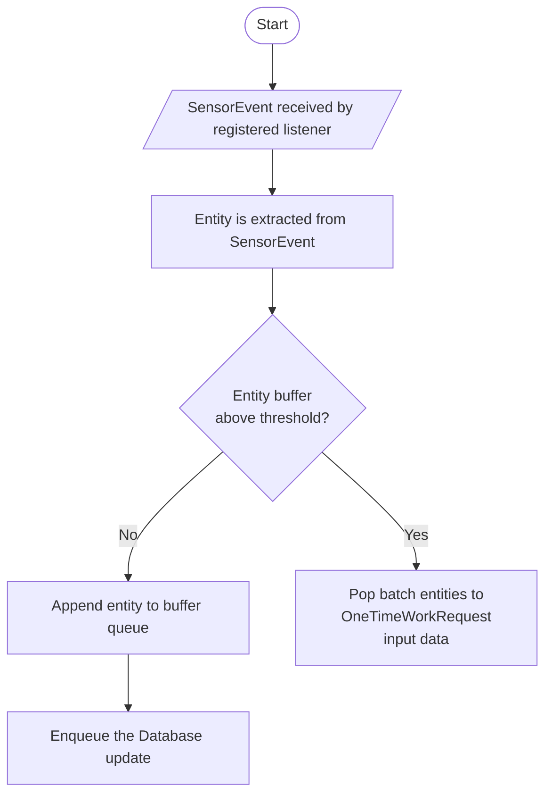

To view the database first pull locally over adb
```
$ adb pull /data/data/com.XXX.module/databases/com.XXX.module.database /Users/somePathOnYourPC/
```


```mermaid
graph TD
    A([Start]) --> B[/SensorEvent received by registered listener/]
    B --> C[Entity is extracted from SensorEvent] 
    C --> D{Entity buffer<br>above threshold?}
    
    D --> |No| E[Append entity to buffer queue]
    D --> |Yes| F[Pop batch entities to<br> OneTimeWorkRequest input data]

    E --> G[Enqueue the Database update]

   


style A fill:#ffffff
```
